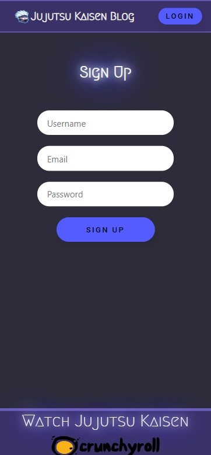
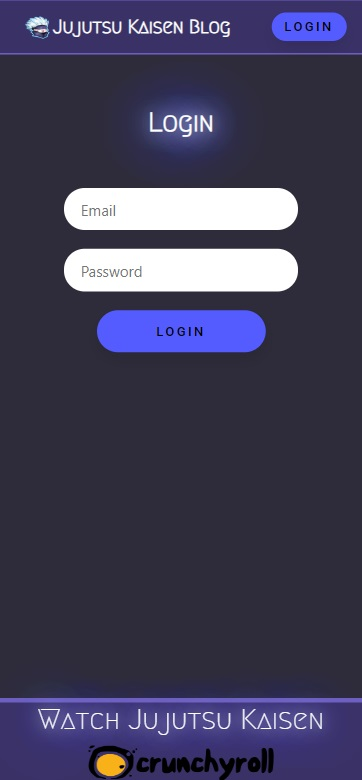
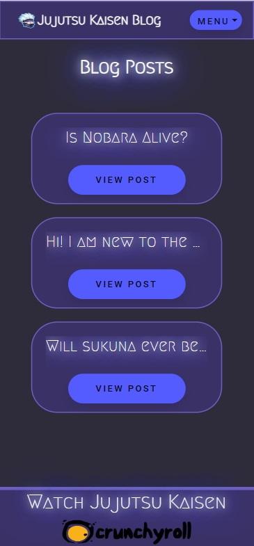
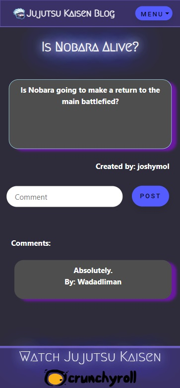
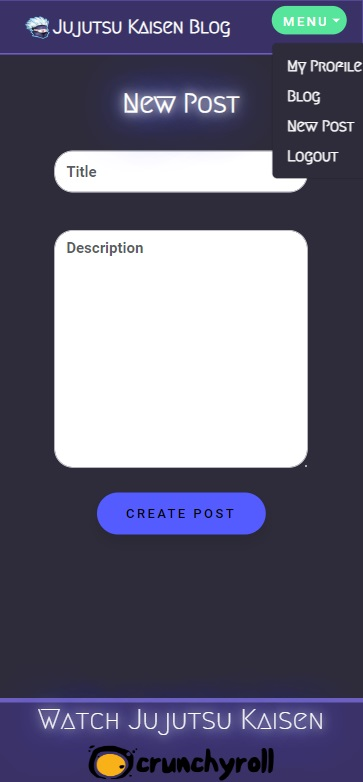
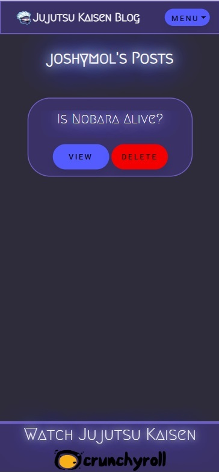
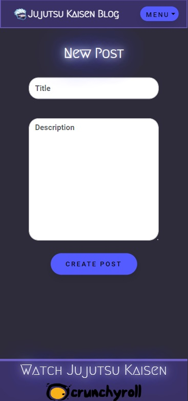

# JJK-FanBlog
Jujutsu Kaisen dedicated blog for fans 

 

 

## Description:

My Jujutsu Kaisen Fan Blog is designed to provide a community for fans of the anime/manga series to discuss theories, and other topics related to the anime.

 

## Table of Content:

  - [Installation](#installation)
  - [Usage](#usage)
  - [Link](#link)
  - [License](#license)
  - [How to Use](#howtouse)

   

## Installation:
  
   To install this app clone the code into your preferred directory.
  
 

 ## Usage:

 Use the command line terminal, navigate to JJK-FanBlog repository, run "npm i" command, then "npm run seed" 
 command to run the seeds files, and then "npm run develop" to start the server. 
 As soon the command is run a browser tab will be opened and the user will be directed to http://localhost:3001 where they can use the website locally
  
  Or the user can open the deployed with the link below. 👇
  
   
  
  ## Link

  To lunch the app click here  👉   

   

  ## License
  
  
  This application is covered under [MIT License](https://choosealicense.com/licenses/mit/)

  ## HowToUse

  The following image shows the landing page for the blog: 
  
  

  You can sign up by clicking the sign up button on the landing page. If you already have an account you can also login using the button in the navigation banner: 

  

 * Test login account: email: test@email.com , password: test123 
 
  

  Once logged in you will be taken to the blog page, here you can see all user blog posts: 

  

  Clicking on "View Post" will take you to the full blog post, here you can see the contents of the blog post as well as user comments. You are also able to post your own comments: 

  

  Clicking on the "Menu" button in the navigation banner will show you different options available to you: 

  

  Clicking on "My Profile" will take you to a page which shows only blog posts made by the current logged in user. Here you have the option to delete those posts if you desire: 

  

  Clicking on "New Post" will take you to the screen where you can create a post to the blog: 

  

  

